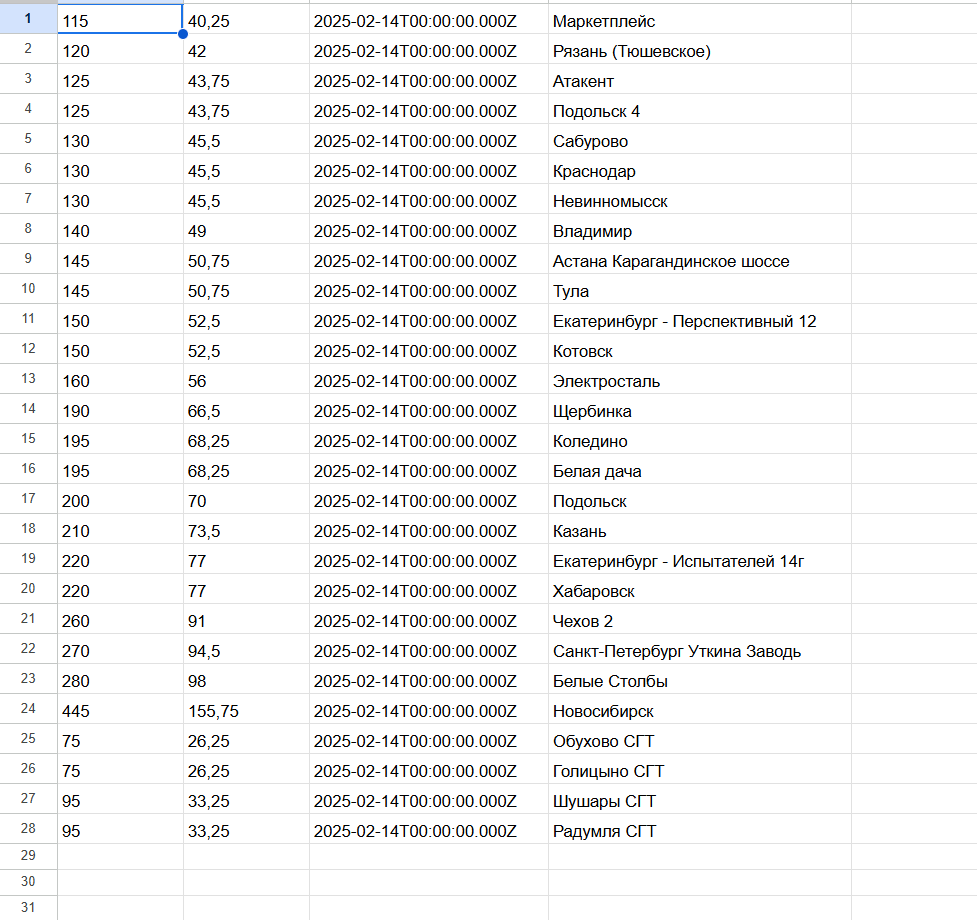

# Wb tariffs service:

## All instructions for launching are made from under Ubuntu. If you test the app from Windows, then you may have to install some technologies such as nodejs and docker

## Clone the repository
1. Open Visual Studio Code,
2. Open WSL
3. ```git clone https://github.com/george-leontev/wb-tariffs-service.git```

## Install dependencies
```npm install```

## Startup Instructions
1. Install Docker Engine if necessary: <ins>https://docs.docker.com/engine/install/ubuntu/</ins>

2. Run command ```docker compose -f 'docker-compose.yaml' up -d --build```

3. If open docker-compose.yaml file.

4. Right-click on the <ins>docker-compose.yaml</ins> file.

5. Click on the **Compose Up** button.

### After the Docker container are up and running you finnaly can use app :)

# Important:
### You must create a file ```google-credentials.json``` with necessary Google service account credentials.
### In the ```.env.production``` file you should also add your Google Sheets ids to the TARGET_SHEETS variable.

# Demo:

## By accessing the logs of the web api docker container, you can monitor the application's processes in real-time:


## Also you can check your Google Sheets:

